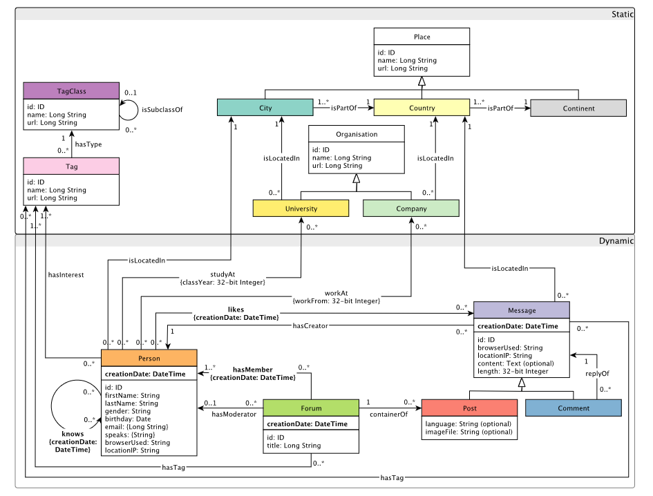

# ldbc-snb-converter

This is a simple tool to convert the LDBC SNB data set to a format that can transform the snb dataset into something aerospike graph can load.

Snipped from the snb specification, the data set has the following schema:

So our vertex labels are:
- Place [City, Country, Continent]
- Organization [Company, University]
- Message [Post, Comment]
- TagClass
- Tag
- Person
- Forum

Note: 
- City, Country, and Continent are sub-classes of Place
- Company and University are sub-classes of Organization
- Post and Comment are sub-classes of Message

Our edge labels are:
- Forum-containerOf->Post
- Message-hasCreator->Person
- Person-hasInterest->Tag
- Forum-hasMember->Person
- Forum-hasModerator->Person
- Message-hasTag->Tag
- Forum-hasTag->Tag
- Tag-hasType->TagClass
- Company-isLocatedIn->Country
- Message-isLocatedIn->Country
- Person-isLocatedIn->City
- University-isLocatedIn->City
- City-isPartOf->Country
- Country-isPartOf->Continent
- TagClass-isSubclassOf->TagClass
- Person-knows->Person
- Person-likes->Message
- Comment-replyOf->Message
- Person-studyAt->University
- Person-workAt->Company